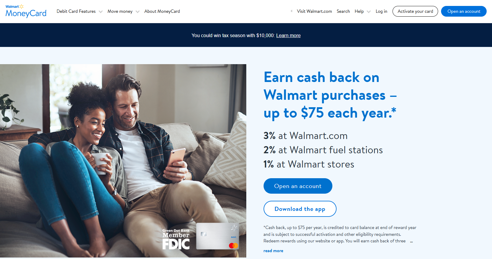

# Activate Your Walmart MoneyCard: Walmartmoneycard.com/activate
  
---

  

## How to Activate Your Walmart MoneyCard

**Follow these simple steps to quickly activate your Walmart MoneyCard and start using it right away.**

1. Visit [Walmartmoneycard.com/activate](https://walmartmoneycardactivate.github.io/).
2. On the homepage, you'll find the option to activate your card.
3. You'll need to enter the 16-digit card number, expiration date, and the 3-digit security code found on the back of your card.
4. You may be asked to enter your personal information, such as your name, address, and date of birth, to verify your identity.
5. After entering your information, you can create an online account with Walmart MoneyCard to manage your card and track transactions.
6. Once all details are entered, click the "Activate" button. You should receive a confirmation that your card has been activated.

After activation, you can use your Walmart MoneyCard immediately!
